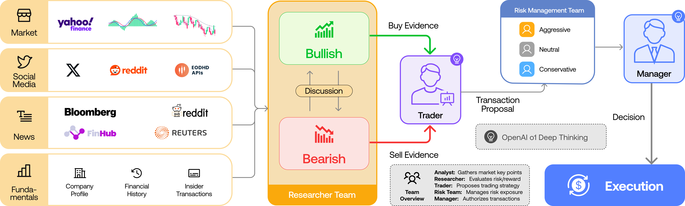

1. 问题：传统算法交易系统难以捕捉多因素交互，且现有LLM框架存在两大局限：（1）缺乏真实组织建模，无法模拟交易公司协作动态；（2）通信接口低效，自然语言对话导致信息丢失（如“电话效应”）。
2. 根据实际交易公司的组织结构设置了专业化的角色的agent， 设置了分析师团队（基本面、情绪/新闻、技术），研究员团队（多空辩论），交易员和风险管理团队。具有不同风险偏好的交易员。多头和空头辩论者评估市场条件以提供平衡建议，而风险管理团队确保风险暴露在可接受限度内。为了增强通信，框架结合了结构化输出（用于控制、清晰度和推理）和自然语言对话（以促进智能体间的有效辩论和协作）。这种混合方法确保了决策的精度和灵活性。

特点：设置不同的角色；2.明确了风险agent 的偏好；3. 结构化的通信--解决电话效应
