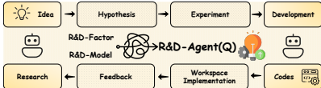
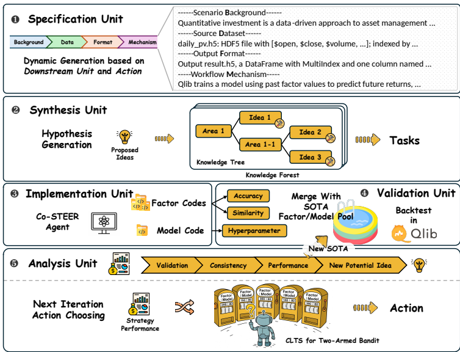

1. 问题：量化研究管道自动化不足、可解释性差，且因子挖掘与模型优化碎片化，导致迭代慢、泛化弱。微软的开源项目Qlib简化了数据处理和回测-问题的关键在因子挖掘和模型创新。
2. 特色：数据中心，将量化流程分解为研究阶段（动态生成假设）和开发阶段（代码生成代理Co-STEER实现因子/模型代码），通过多臂赌博机调度器自适应选择优化方向，实现因子-模型联合优化。

   

   

实证上，R&D-Agent(Q)实现比经典因子库高2倍的年化回报，使用70% fewer因子，并在真实市场上超越最先进深度时间序列模型。其联合因子-模型优化在预测精度和策略鲁棒性间提供强平衡。

五阶段LLM驱动的单元：规范单元（定义任务约束，场景定义）、合成单元（生成假设森林，生成假设）、实现单元（Co-STEER代理代码生成）、验证单元（去冗余回测）、分析单元（多指标评估）。闭环循环中操作。因子和模型组件的动态协同优化，每轮的假设、实现和结果持久存储

* Co-STEER代理：集成链式思维和知识库，支持任务调度和迭代调试；使用上下文多臂赌博机（Thompson采样）自适应选择因子或模型优化方向。
* 数据中心设计：LLM仅接触模式级信息，避免数据泄露。
