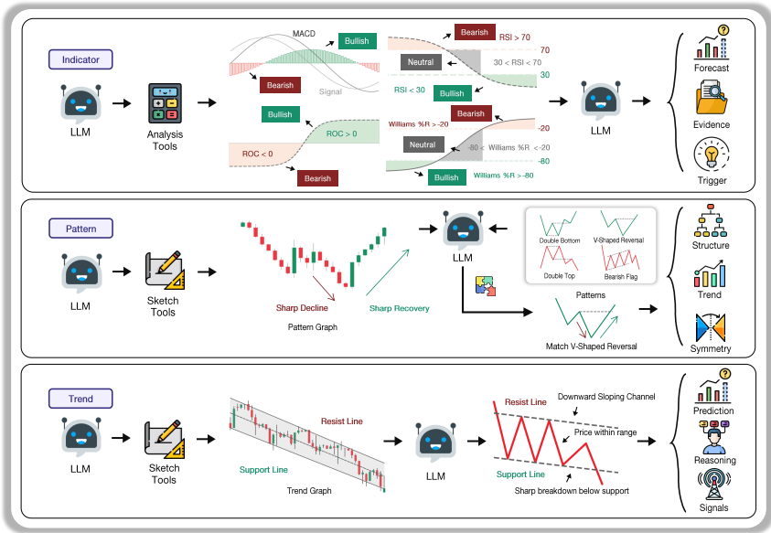
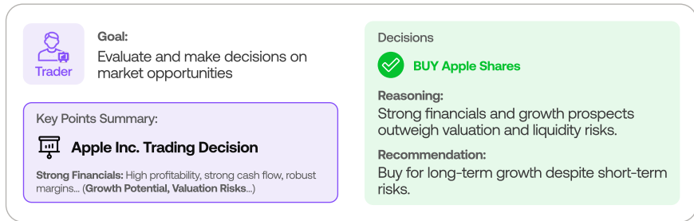

1. 问题：现有LLM框架依赖文本输入（如新闻），不适合高频交易的低延迟需求；技术指标和模式分析在噪声环境中易失效。--时效
2. 仅基于OHLC（开盘-最高-最低-收盘）数据，使用四个专门代理：IndicatorAgent（技术指标分析）、PatternAgent（图表模式识别）、TrendAgent（趋势检测）和RiskAgent（风险整合）。通过LLM推理将价格信号转化为可追溯的交易决策。结构化提示通信

   1. IndicatorAgent（技术指标分析）--将OHLC序列转化，计算指标（如RSI、MACD，RoC，STOCH，WILLR）
   2. PatternAgent（图表模式识别）--通过LLM绑定工具生成图表并识别模式（如双底形态），解决上一个分析中的数值指标在价格运动停滞或进入新 regime 时可能变得不清晰
   3. TrendAgent--使用斜率感知算法（Algorithm 1）拟合趋势，提供趋势动态的结构表示，澄清检测到的模式是否与主流趋势一致、信号潜在反转或指示非方向性价格拥堵阶段
   4. RiskAgent --整合信号设置止损/止盈。
   5. DecisionAgent--接收聚合信号，输出结构化交易决策
3. 特色：纯价格驱动；

   
